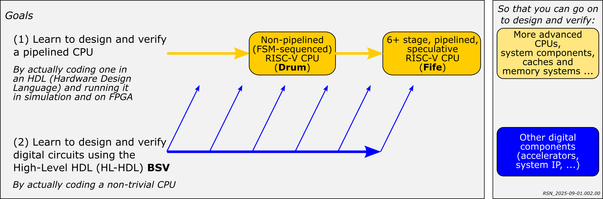
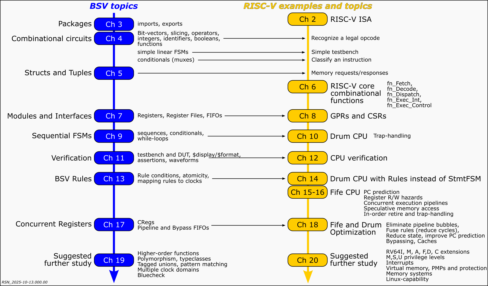

= Learn Bluespec and RISC-V Design
(c) Rishiyur S. Nikhil, Bluespec, Inc. 2024-2025
:revnumber: v0.981
:revdate: 2025-10-13.A
:sectnums:
:toc:
:toclevels: 3
:toc-title: Contents
:keywords: Bluespec, B-Lang, BSV, BH, RISC-V, Pipelined CPU, HDL, HLHDL, High Level Hardware Design Language, Fife, Drum

// ****************************************************************

[NOTE]
====
Please only submit "Issues", and not PRs, to this repository.  This
repository is not a development repository, just the place where we
assemble "distributions" of the book, code, and courseware which are
developed elsewhere (hence PRs here would not be actionable).
====

[NOTE]
====
This document's source is `README.adoc` and can be read as-is
in a text-editor or terminal.  It can also be processed with the free,
open-source `asciidoctor` tool into `README.html` and viewed in
any browser.  GitHub will automatically display .adoc documents.
====

'''

// ****************************************************************

== Introduction

This is a pre-release of free and open-source materials for a course:
"Learn RISC-V CPU Implementation and *BSV*", suitable for self-study or
classroom use.  The goals for the course are:

Outline of repository contents:
----
.
├── README.{adoc,html}
├── LICENSE
├── Book_BLang_RISCV.pdf
├── Code/
│   ├── src_*/
│   ├── Build/
│   ├── Doc/
│   └── ...
├── TestRIG
│   ├── src_Top_TestRIG/
│   ├── Build/
│   ├── Doc/
│   └── ...
├── Doc
│   └── Installing_bsc_Verilator_etc.{adoc,html}
├── Exercises/
└── Slides/
----

`Book_BLang_RISCV.pdf`:: Textbook (300+ pages) +
+
WARNING: Apparently the PDF does not render correctly on GitHub in some
browsers ("Error rendering embedded code; Invalid PDF"), e.g.,
DuckDuckGo on some MacOSs). +
It does render correctly in other browsers (e.g., Safari and Firefox on MacOS). +
It does render correctly if you download it and use a PDF viewer
(e.g., Preview on MacOS).

`Code/`:: Full source codes for *Fife* and *Drum* RISC-V CPUs, along
with Makefiles to build and run using free and open-source tools.
`Code/Doc/Build_and_Run_Guide.{adoc,html}` explains how to:

* compile and run in Bluesim (*BSV*'s native code simulator), using the _bsc_ compiler.

* compile and run in Verilog simulation, using the _bsc_ compiler to
  compile *BSV* to Verilog, and _Verilator_ to simulate the Verilog. +
  [Coming: separate documentation on how to run *Fife* and *Drum* on
  FPGAs.]

`TestRIG/`:: Full source code and build setup for optional top-level
for fitting *Fife* and *Drum* into University of Cambridge's *TestRIG*
framework for automated, property-based testing (cf. Haskell
QuickCheck), comparing correct execution against the official
*Sail*-based _RISC-V Formal Model_. Relevant links: +
[verse]
link:https://en.wikipedia.org/wiki/QuickCheck[]
link:https://github.com/CTSRD-CHERI/TestRIG[]
link:https://github.com/riscv/sail-riscv[]

`Slides/`:: Lecture slides for Chapters 1-18 (no slides for Chapters 19-20)

`Exercises/`:: Code for exercises in book appendix ``Exercises''

// ****************************************************************

== Installing prerequisite software tools

The minimum installation is _bsc_ compiler, to compile and run *Fife*,
*Drum*, and the exercises, using Bluesim.  The _bsc_ repository
distributes pre-built binaries for various Linuxes and MacOS (just
download and untar).

_bsc_ can also produce Verilog.

_bsc_-produced Verilog can run in any Verilog simulator.  We recommend
a specific free and open-source Verilog simulation tool, *Verilator*:
+ link:https://github.com/verilator/verilator[]

If you want to run *TestRIG* for verification, you need a few more
tools (*Sail*, *TestRIG*).

Please see link:Doc/Installing_bsc_Verilator_etc.html[] for more
details on installation.

// ****************************************************************

== About the pedagogic approach

We take a unique approach in that, as far as possible, we try to
"factor out" RISC-V ISA semantics questions from pipelining questions,
but describing the design of _two_ RISC-V CPU implementations, in this
order:

*Drum*:: An "FSM" implementation, which almost looks like a software
  RISC-V simulator written in C, except that it is fully synthesizable
  to hardware (runnable on FPGAs, ASICs).

*Fife*:: A 6+ stage, mostly in-order, pipelined implementation,
  including simple branch prediction, scoreboarding, in-order
  retirement, and speculative STOREs with a store-buffer.

The two implementations share _all_ the functional parts of RISC-V
code, which are covered in the first part of the book, with *Drum*.
By the time we reach the second part of the book, on *Fife*, we can
focus purely on pipelining questions, since all RISC-V-specific
semantics have already been covered with *Drum*.

Both CPUs are useful in hardware: *Drum* will have lower performance
(IPC, or instructions per cycle) than *Fife*, but likely lower area
and energy cost.  *Drum* can also be used as a hardware-synthesizable
"reference model" for *Fife*.

We interleave RISC-V and *BSV* topics in an incremental and mutually
reinforcing way, and describe the full design and verification process
and the code in detail.  We hope to avoid steep learning curves for
*BSV* and for RISC-V.  This diagram shows the interplay between *BSV* and
RISC-V chapters:

The exercises in `Exercises/` are synchronized with the Book, in which
there are small sections titled **Exercises**, each pointing to a
particular `Exercises/` sub-directory.  In each such sub-directory
there is a README describing the exercise in more detail.  The first
task in each README is normally just to run the code provided for that
exercise, which should compile and run immediately with the provided
Makefile (this can also be demo'd during a lecture).  The README then
has suggestions for variations for students to try on their own.

*Fife* and *Drum* implement the "RV32I" subset of the RISC-V
Unprivileged ISA, plus a few features from the Privileged
specification sufficient to to handle illegal instructions and other
traps, and interrupts.  This is adequate for small embedded systems.
The book discusses how to extend *Fife* and *Drum* into 64-bit
Linux-capability.

We welcome feedback about your learning experience.

// ****************************************************************

== About RISC-V and *BSV*

RISC-V is an open-standard ISA (Instruction-Set Architecture).  ISA
specification documents can be found at
https://riscv.org/technical/specifications/[].  The site
https://riscv.org/[] also contains much additional useful material, in
particular information on GNU compilation/debugging tools gcc, gdb,
etc.

Bluespec *BSV* is a free, open-source HLHDL (High-Level Hardware Design
Language), a significant improvement in expressive power and
simplicity compared to Verilog/SystemVerilog/VHDL.  Its free,
open-source compiler is available at:
link:https://github.com/B-Lang-org/bsc[].  An appendix in the book
discusses "Why *BSV*?" in more detail.

// ****************************************************************

== Status

This repository is expected to be updated periodically as we improve
the book and the code.  When you clone it, you may wish to keep track
of commit/date so that you can check if you have the latest version,
and/or revert to an earlier version if needed.

The following are in reverse chronological order (latest first).

// ================================================================

''''

=== Status, October 13, 2025    (2025-10-13)

*Book*:: Upgraded to latest code changes. Other stylistic edits

*Code*:: Upgraded to run *Fife* and *Drum* under *TestRIG*. A few
 *bugfixes uncovered by TestRIG*. Added bypassed register file.
+
Tested on ISA tests from
https://github.com/riscv-software-src/riscv-tests[].  *Fife* and
*Drum* PASS all 39 `rv32ui-p-...` tests, and 10/11 of the
`rv32mi-p-...` tests (we ignore the 11th test, `rv32mi-p-breakpoint`,
because it requires Debug Module CSRs which are not currently
implemented in *Fife* and *Drum*).

* *Slides* (for lectures): No change from 2024-08-07 version; needs updating.

* *Exercises* (for labs): Added a few more exercises.

// ================================================================

''''

=== Status, August 7, 2024 (2024-08-07)

Here, ``complete'' means full first draft.  Once each component is
complete, we expect a final, complete, careful editing pass for
smoothing and cleanup.

* *Book*: complete except for the final two chapters (19, 20) which
  contain suggestions for future study of *BSV* and future study of
  RISC-V, respectively.

* *Code*: *Fife* and *Drum* codes complete.
+
Tested on ISA tests from
https://github.com/riscv-software-src/riscv-tests[].  *Fife* and
*Drum* PASS all 39 `rv32ui-p-...` tests, and 10/11 of the
`rv32mi-p-...` tests (we ignore the 11th test, `rv32mi-p-breakpoint`,
because it requires Debug Module CSRs which are not currently
implemented in *Fife* and *Drum*).

* *Slides* (for lectures): complete.

* *Exercises* (for labs): In progress; expected completion by end of
  August 2024.

// ****************************************************************
